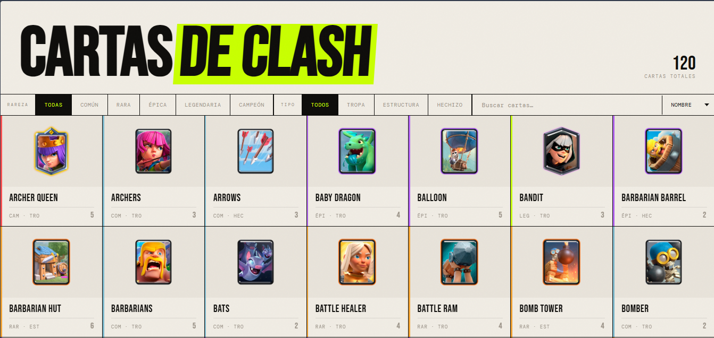
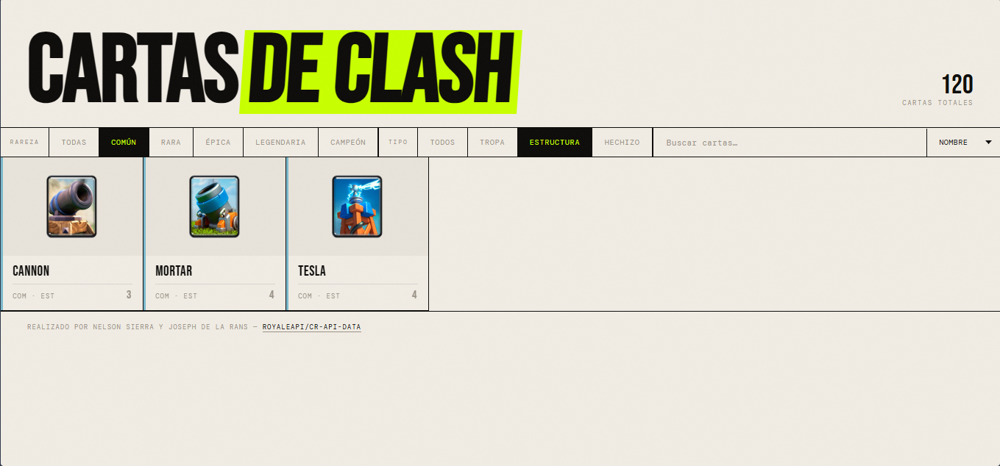
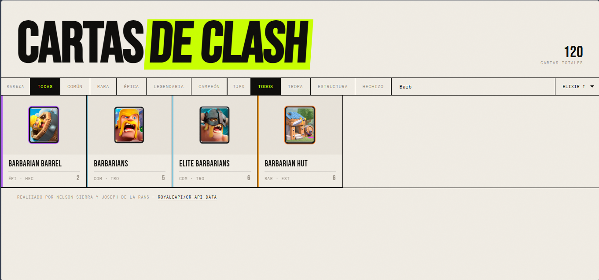
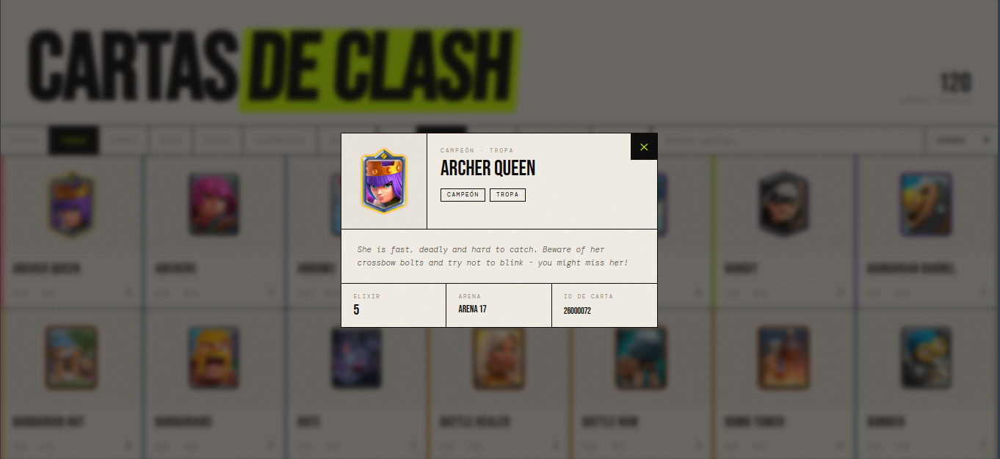

# Clash API REST - Cartas de Clash

Aplicacion web frontend que consume una API REST publica de Clash Royale para listar cartas, filtrarlas, buscarlas, ordenarlas y ver detalles en un modal.

## Demo local

No requiere build ni dependencias. Solo abre [index.html](index.html) en el navegador o levanta un servidor estatico.

## Funcionalidades

- Consumo de API REST con fetch.
- Listado de cartas en grid responsivo.
- Filtro por rareza.
- Filtro por tipo.
- Busqueda por nombre.
- Orden por nombre, elixir asc, elixir desc y arena.
- Modal de detalle por carta.
- Conteo total de cartas cargadas.
- Estado de carga y estado vacio.

## Stack

- HTML5
- CSS3
- JavaScript vanilla
- Fuente de datos: RoyaleAPI

## Estructura del proyecto

- [index.html](index.html): estructura principal de la UI.
- [styles.css](styles.css): estilos, layout responsivo, animaciones y modal.
- [app.js](app.js): logica de fetch, filtros, render, orden, busqueda y modal.
- [screenshots/.gitkeep](screenshots/.gitkeep): carpeta para almacenar capturas.

## API consumida

- Endpoint: https://royaleapi.github.io/cr-api-data/json/cards.json
- Imagenes: https://cdn.royaleapi.com/static/img/cards-150/

## Como ejecutar

### Opcion 1: abrir directo

1. Abre [https://nessisx.github.io/Clash-API-REST/](Pagina) en el navegador.

### Opcion 2: servidor local con Python

1. En la raiz del proyecto, ejecuta:
   python -m http.server 5500
2. Abre:
   http://localhost:5500

### Opcion 3: VS Code + Live Server

1. Instala la extension Live Server.
2. Click derecho en [index.html](index.html) y selecciona Open with Live Server.

## Documentacion visual (screenshots)

### Vista general

### Filtros

### Busqueda y orden

### Modal de detalle

## Autores

- Nelson Sierra
- Joseph De la Rans

## Creditos

- Datos y assets: https://github.com/RoyaleAPI/cr-api-data
